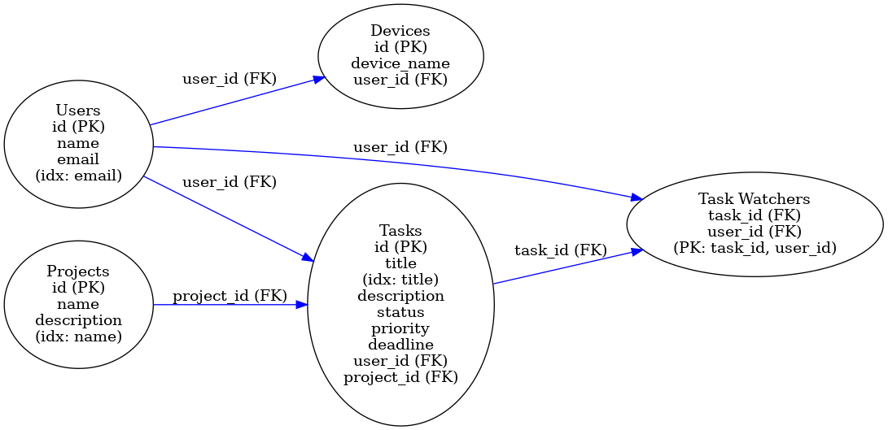

# Task Manager Api
Managers are having problems to manage their teams tasks inside of the office, they never know who’s working on certain tasks and when’s its deadlines. Thus, they need your help to build a solution for them. With this scenario in mind you need to create an API using Spring Framework, that will help those managers to keep going with their projects.

## Features

- **Assign a task to a user**: Users can easily assign tasks to specific team members, ensuring clear ownership and accountability for every task. This feature helps streamline workflows and clarifies who is responsible for task completion;
- **Specify the Project the Task is About**: Each task can be linked to a specific project, making it easier to organize work and maintain focus on project deliverables. This feature helps users track progress within distinct projects and reduces confusion by keeping tasks properly categorized;
- **Users Can Watch Tasks to Receive Notifications**: Users Can Watch Tasks to Receive Notifications about status changes;
- **Filter Tasks by User, Priority, Status, and Projects**: Users can filter tasks based on different parameters such as assigned user, priority level, task status, and the associated project. This powerful filtering capability allows for focused task management and helps users find specific tasks quickly, leading to improved productivity and task visibility. Also the return of that query can be paginated;
- **Priority of the tasks**: Set priority to tasks such as Low, Normal, High;
- **Multi-module Project Structure**: Organized into separate modules for better code organization and maintenance.

## Dependencies

- Java 21
- Spring Boot
- Maven
- Kafka
- PostgreSQL

## Modules

1. **task-manager-core**: Contains the core business logic and domain models.
2. **task-manager-domain**: Contains the core domain models and business logic for the task manager system.
3. **task-manager-http-resources**: Implements RESTful APIs using Spring Web for handling task manager requests.
4. **task-manager-messaging**: Integrates with Kafka for handling messaging-related tasks.
5. **task-manager-persistence**: Handles persistence using JPA and provides repositories for accessing database entities.
6. **task-manager-processor**: The task-manager-processor module is an integral part of the app's architecture, designed to handle commands in a structured and decoupled manner. Following the command processor pattern, this module serves as a central processing unit that receives, validates, and executes commands related to task management operations. Leveraging the hexagonal architecture, the module ensures a clear separation between the core business logic and external systems or interfaces.

## Clone the Repository

```shell
    git clone https://github.com/fabiofreire1208/task-manager-api.git
```

## Build

To build the project, you can use the Maven command provided below. This command will clean the project and then package it, using two CPU cores to speed up the process:

```shell
mvn -T 2C clean package
```

## Configuration

- **Database Configuration**: Configure database settings in `application.properties` files located in each module.
- **Messaging Configuration**: Set up Kafka connection properties in `application.properties` files in the messaging module.


## Api Request

The following requests contains comprehensive information for a complete flow of create users, devices, projects and tasks.

Create User
```shell
curl --request POST \
  --url http://localhost:8080/users/add \
  --header 'Content-Type: application/json' \
  --header 'User-Agent: insomnia/10.1.0' \
  --data '{
	"name": "User",
	"email": "user@gmail.com"
}'
```

Add Device
```shell
curl --request POST \
  --url http://localhost:8080/devices/add \
  --header 'Content-Type: application/json' \
  --header 'User-Agent: insomnia/10.1.0' \
  --data '{
	"deviceName": "User device",
	"user_email_info": {
		"email": "user@gmail.com"
	}
}'
```

Create Project
```shell
curl --request POST \
  --url http://localhost:8080/projects/add \
  --header 'Content-Type: application/json' \
  --header 'User-Agent: insomnia/10.1.0' \
  --data '{
	"name": "Project task manager",
	"description": "Project description."
}'
```

Create Task
```shell
curl --request POST \
  --url http://localhost:8080/tasks/add \
  --header 'Content-Type: application/json' \
  --header 'User-Agent: insomnia/10.1.0' \
  --data '{
	"title": "My Task",
	"description": "Task Description",
	"status": "OPENED",
	"priority": "LOW",
	"deadline": "2024-11-30T23:59:00",
	"assignedUserId": "ca60ba75-33b7-439b-899e-35e6fa0b8089",
	"projectId": "58e30c2f-e10d-47a4-ae66-b13570a0b538"
}'
```

Update Assigned User
```shell
curl --request PUT \
  --url http://localhost:8080/tasks/3fcd6600-1473-4e96-9250-e533e4554e3f/user/assign \
  --header 'Content-Type: application/json' \
  --header 'User-Agent: insomnia/10.1.0' \
  --data '{
	"userId": "ca60ba75-33b7-439b-899e-35e6fa0b8089"
}'
```

Update Task Status
```shell
curl --request PUT \
  --url http://localhost:8080/tasks/cbd6d645-295d-4696-a750-658b880880d8/status \
  --header 'Content-Type: application/json' \
  --header 'User-Agent: insomnia/10.1.0' \
  --data '{
	"status": "IN_PROGRESS"
}'
```

Add Watcher
```shell
curl --request POST \
  --url http://localhost:8080/tasks/add/watchers/list \
  --header 'Content-Type: application/json' \
  --header 'User-Agent: insomnia/10.1.0' \
  --data '{
	"id": "81792efc-649d-4f8b-8b5b-2f0100fe160a",
	"watcherIds": [
    "47160c51-34d0-4d06-979a-ba9f8d4ce305"
  ]
}'
```

Filter Tasks
```shell
curl --request GET \
  --url 'http://localhost:8080/tasks/filter?page=0&size=10&status=IN_PROGRESS' \
  --header 'User-Agent: insomnia/10.1.0'
```
List Users
```shell
curl --request GET \
  --url http://localhost:8080/users/list \
  --header 'User-Agent: insomnia/10.1.0'
```

List Projects
```shell
curl --request GET \
  --url http://localhost:8080/projects/list \
  --header 'User-Agent: insomnia/10.1.0'
```

List Devices
```shell
curl --request GET \
  --url http://localhost:8080/devices/list \
  --header 'User-Agent: insomnia/10.1.0'
```

## Running the Project

To start the project, you need to use Docker Compose. Make sure Docker and Docker Compose are installed on your machine. The docker-compose.yml file can be found in the root folder of the project.

To run the project, follow these steps:

1. **Navigate to the directory containing the docker-compose.yml file:**

2. **Run the following command in the terminal:**

```shell
docker-compose up
```
This command will:

- **Download all the necessary Docker images.**
- **Build the containers defined in the docker-compose.yml file.**
- **Start all the project services configured to run in Docker containers.**

## Database Diagram


